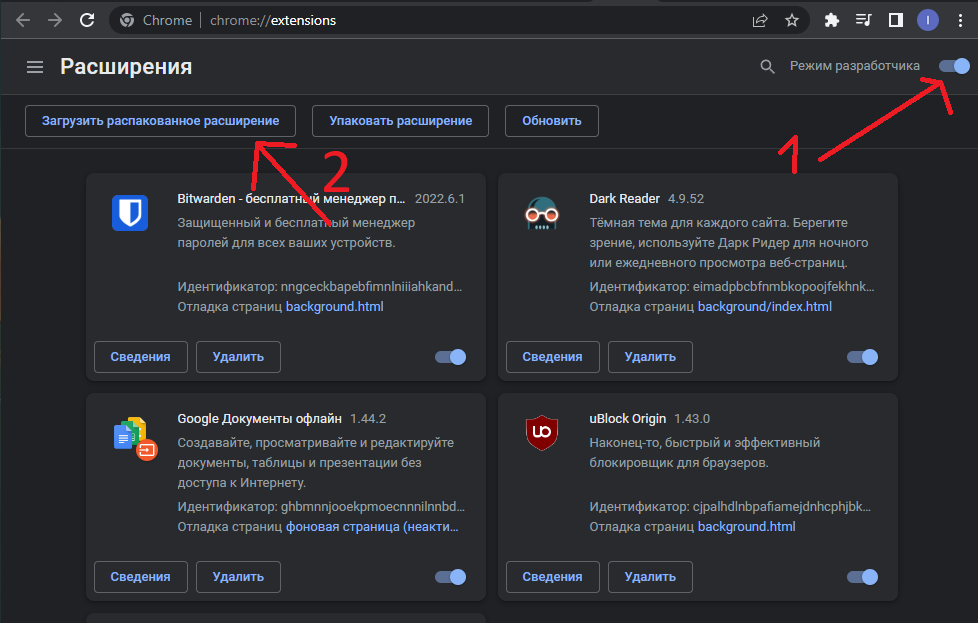
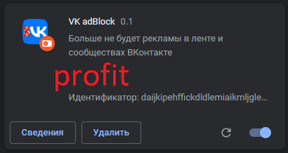

# How to install this extension:
I can't upload it to google store because we have to install it by our own hands.

1. Clone repo or just download it as zip and extract in some folder
2. Open Google Chrome or other your browser.
3. Open extensions menu.
4. In settings enable developer mode.
5. Click "Load unpacked" and choose folder with extension.
6. DONE!

